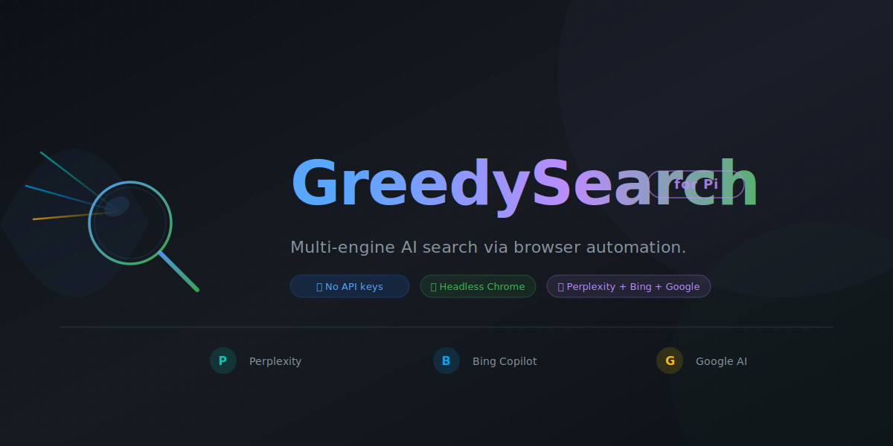

# GreedySearch for Pi



Multi-engine AI web search for Pi via browser automation.

- No API keys
- Real browser results (Perplexity, Bing Copilot, Google AI)
- Optional Gemini synthesis with source grounding
- Chrome runs headless by default — no window, purely background

## Install

```bash
pi install npm:@apmantza/greedysearch-pi
```

Or from git:

```bash
pi install git:github.com/apmantza/GreedySearch-pi
```

## Tools

- `greedy_search` — multi-engine AI web search
- `websearch` — lightweight DuckDuckGo/Brave search (via pi-webaio)
- `webfetch` / `webpull` — page fetching and site crawling (via pi-webaio)

## Quick usage

```js
greedy_search({ query: "React 19 changes" });
greedy_search({ query: "Prisma vs Drizzle", engine: "all", depth: "fast" });
greedy_search({
  query: "Best auth architecture 2026",
  engine: "all",
  depth: "deep",
});
// Headless is the default — no window. To see the browser:
// Set GREEDY_SEARCH_VISIBLE=1 before launching Pi
```

## Parameters (`greedy_search`)

- `query` (required)
- `engine`: `all` (default), `perplexity`, `bing`, `google`, `gemini`
- `depth`: `standard` (default), `fast`, `deep`
- `fullAnswer`: return full single-engine output instead of preview
- `headless`: set to `false` to show Chrome window (default: `true`)

## Environment variables

| Variable                             | Default       | Description                                               |
| ------------------------------------ | ------------- | --------------------------------------------------------- |
| `GREEDY_SEARCH_VISIBLE`              | (unset)       | Set to `1` to show Chrome window instead of headless      |
| `GREEDY_SEARCH_IDLE_TIMEOUT_MINUTES` | `5`           | Minutes of inactivity before auto-killing headless Chrome |
| `GREEDY_SEARCH_LOCALE`               | `en`          | Default result language (en, de, fr, es, ja, etc.)        |
| `CHROME_PATH`                        | auto-detected | Path to Chrome/Chromium executable                        |

## Depth modes

- `fast` - quickest, no synthesis/source fetching
- `standard` - balanced default for `engine: "all"` (synthesis + fetched sources)
- `deep` - strongest grounding and confidence metadata

## Runtime commands

```bash
node ~/.pi/agent/git/GreedySearch-pi/bin/launch.mjs
node ~/.pi/agent/git/GreedySearch-pi/bin/launch.mjs --status
node ~/.pi/agent/git/GreedySearch-pi/bin/launch.mjs --kill
```

## Requirements

- Chrome
- Node.js 20.11.0+ (22+ recommended)

## Anti-detection

Headless Chrome auto-injects stealth patches before any page JavaScript runs:

- `navigator.webdriver` hidden, plugins/languages faked, `window.chrome` shimmed
- WebGL vendor spoofed (Intel Iris), realistic hardware concurrency / memory
- CDP automation markers deleted, `requestAnimationFrame` kept alive
- Human-like click simulation with coordinate jitter and variable delays

This bypasses casual bot detection (Cloudflare checkbox challenges, basic `navigator.webdriver` checks) but does not defeat commercial anti-bot services (DataDome, PerimeterX, Kasada).

When using `depth: "standard"` or `depth: "deep"`, source content is fetched and synthesized:

- **Reddit** — Uses Reddit's public `.json` API for posts and comments (no scraping)
- **GitHub** — Uses GitHub REST API for repos, READMEs, and file trees
- **General web** — Mozilla Readability extraction with browser fallback for bot-blocked pages
- **Metadata** — title, author/byline, site name, publish date, language, excerpt

## Project layout

- `bin/` — runtime CLIs (`search.mjs`, `launch.mjs`, `cdp.mjs`)
- `extractors/` — engine-specific automation + stealth/consent handling
- `src/` — search pipeline, chrome management, source fetching, formatting
- `skills/` — Pi skill metadata

## Testing

Cross-platform test runner (Windows + Unix):

```bash
npm test              # run all tests
npm run test:quick    # skip slow tests
npm run test:smoke    # basic health check
```

Full bash test suite (Unix only):

```bash
npm run test:bash           # comprehensive tests
./test.sh parallel          # race condition tests
./test.sh flags             # flag/option tests
```

## Changelog

See `CHANGELOG.md`.

## License

MIT
